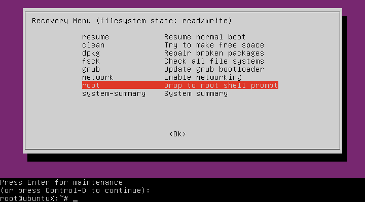

# Загрузка системы

## Задание

- Включить отображение меню Grub.
- Попасть в систему без пароля несколькими способами.
- Установить систему с LVM, после чего переименовать VG.

## Что было сделано

1) Скорректирована конфигурация GRUB и обновлен сам GRUB/

2) После переименования volume-group были внесены изменениея в файл '/boot/grub/grub.cfg'

3) Войдем в систему с помощью корректировки инструкций меню 'grub' (init=/bin/bash):

4) Войдем в систему с помощью 'recovery mode'
