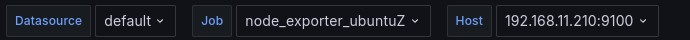
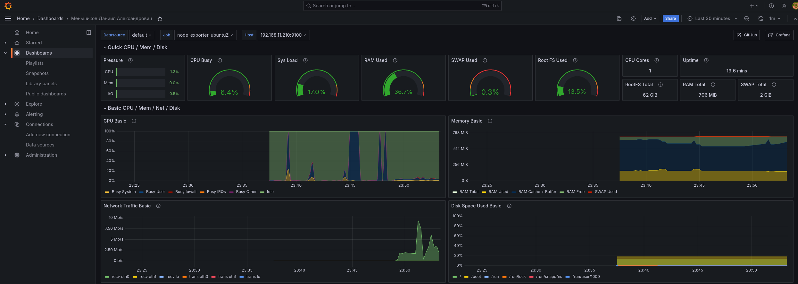

# Мониторинг с помощью Prometheus и Grafana

## Что необходимо сделать

Настроить дашборд с 4-мя графиками:

- память;
- процессор;
- диск;
- сеть.

Настроить на одной из систем:
    - zabbix (использовать screen (комплексный экран);
    - prometheus - grafana.

*Использование систем, примеры которых не рассматривались на занятии.

## Что было сделано

1) Поднимаем две машины ubuntuX и ubuntuZ. Машина ubuntuX будет мониторить машину ubuntuZ, а также будет запущена Grafana для предоставления dashboards.
2) При настройки ubuntuX пробросим порт :9090 на хост :9099 (на слкчай если на хостовой машитне уже есть Prometheus) и :3000 на хост :3009 для доступа к Grafana с хостовой машины.
3) После запуска виртуалок недоходимо донастроить Grafana и установить dashboard Node Exporter Full (id 1860)
4) Затем указываем dashboard откуда брать данные и переименовываем сам dashboard по своему имени:

5) Финальный результат выглядит следующим образом:

