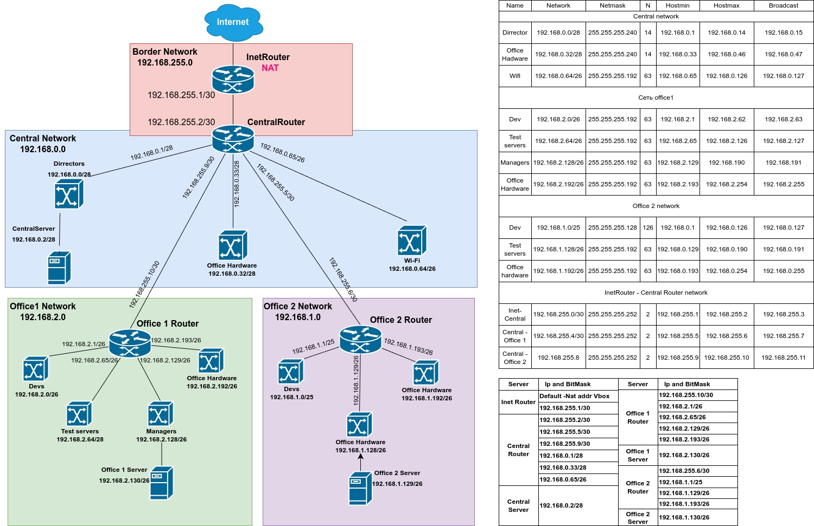

# Архитектура сетей

## Что необходимо сделать

Научится менять базовые сетевые настройки в Linux-based системах. Задание состоит из 2-х частей: теоретической и практической.

В теоретической части требуется:

- Найти свободные подсети
- Посчитать количество узлов в каждой подсети, включая свободные
- Указать Broadcast-адрес для каждой подсети
- Проверить, нет ли ошибок при разбиении

В практической части требуется:

- Соединить офисы в сеть согласно логической схеме и настроить роутинг
- Интернет-трафик со всех серверов должен ходить через inetRouter
- Все сервера должны видеть друг друга (должен проходить ping)
- У всех новых серверов отключить дефолт на NAT (eth0), который vagrant поднимает для связи
- Добавить дополнительные сетевые интерфейсы, если потребуется

Рекомендуется использовать Vagrant + Ansible для настройки данной схемы.

Схема была подготовлена и направлена в телеграмм, что покрывает теоритическую часть.

При подготовке `ansible-playbook` было осуществлено небольшое отступление от методички при настройки `NAT`. Вместо копирования файла с настройками `iptables` были применены модули `ansible`:

- iptables -> для осуществления настроек `ip-tables`
- community.general.iptables_state -> для сохранения текущих настроек `ip-tables`

Также для обеспечения сохранения параметров `ip-tables` применялся пакет `iptables-persistent`. Настройка `ip-tables`сохраняется по пути: `/etc/iptables/rules.v4`. В остальном приманялись рекоммендации из методички.
